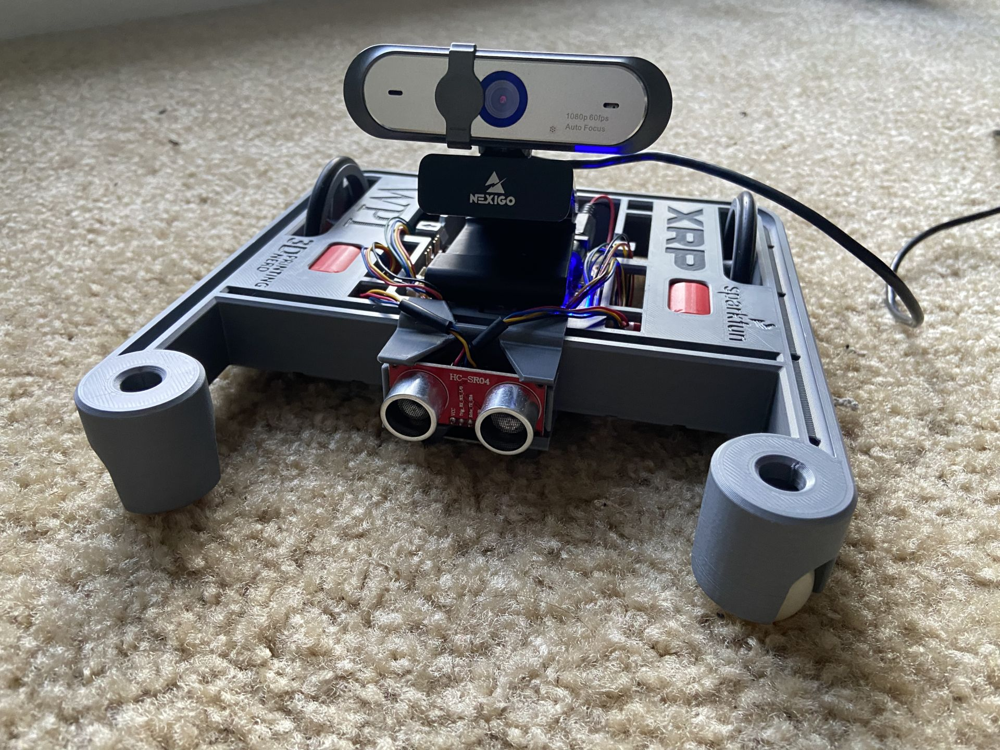
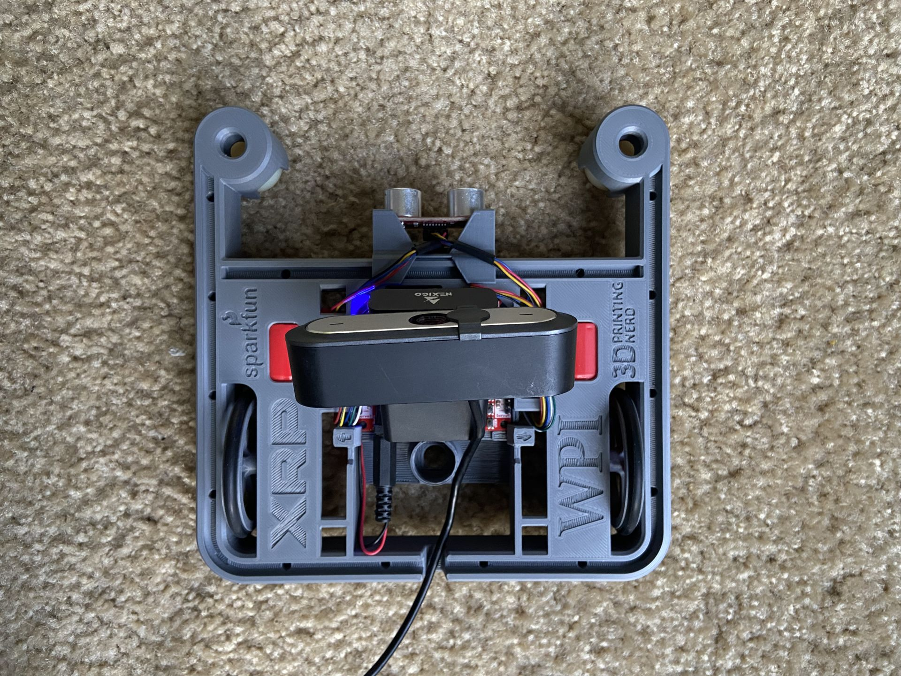
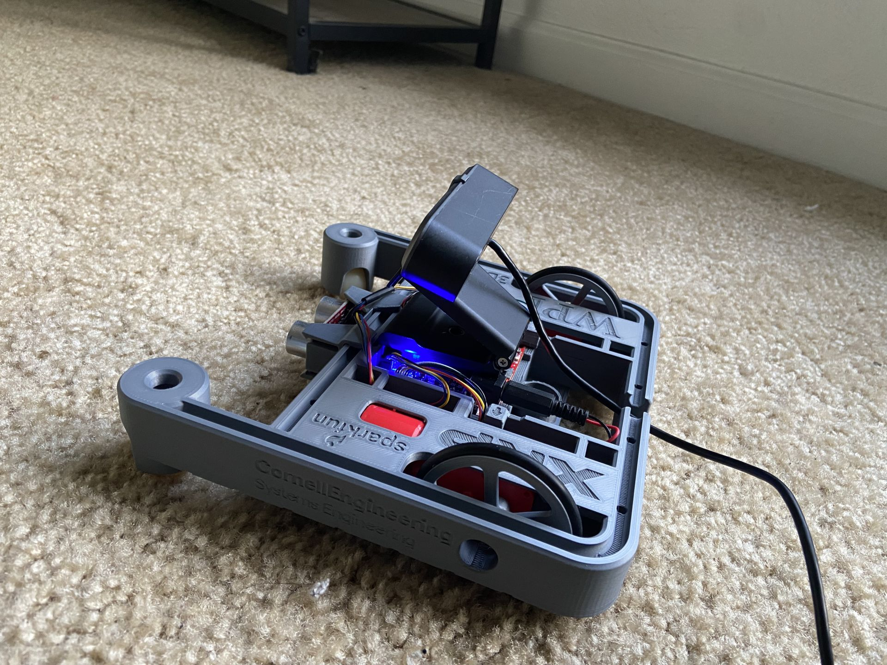

# RoboResponder: Dual-Agent Autonomous Evacuation Rover

An embodied AI robotics platform powered by **Google Gemini 3.8 Live** for real-time conversational triage and **Google Gemini Robotics ER 2** for spatial reasoning, visual memory, and autonomous navigation.

---

## Live Demonstration

[](https://youtu.be/OcAluazqe50)

> 📹 **Watch the Live Demonstration on YouTube**: [https://youtu.be/OcAluazqe50](https://youtu.be/OcAluazqe50)

---

## Hardware Gallery

| Front Perspective | Top / Electronics View | Side Profile |
| :---: | :---: | :---: |
|  |  |  |

---

## Inspiration

During an emergency, navigating an unfamiliar building can be difficult, especially for people with visual, mobility, or other impairments. We wanted to build a robot that could understand its environment through vision and voice, helping guide people toward safety. This led to RoboResponder, an autonomous emergency navigation rover designed to identify exit routes, structural cover, and hazards while keeping evacuees informed out loud.

---

## What It Does

RoboResponder acts as an interactive emergency guide:

- **Voice Triage**: When triggered, the robot asks what emergency has occurred. It listens to evacuees report hazards like fires, earthquakes, or tornadoes, confirms the protocol, and announces instructions aloud such as *"Attention everyone, follow me!"*
- **Visual Spatial Reasoning**: A webcam captures real-time video frames of the room. Gemini Robotics ER 2 analyzes the scene to spot emergency exit signs, sturdy tables for cover, or open interior corridors.
- **Physical Navigation**: Based on what it sees, Gemini Robotics ER 2 directly executes driving tools to move the physical robot forward, steer around obstacles, and guide evacuees toward safety.
- **Reassuring Voice Updates**: Every few movements, the robot provides spoken updates through a speaker to keep evacuees calm and informed as it navigates.

---

## System Architecture

```mermaid
flowchart TB
    %% -----------------------------------------------------------
    %% STYLING AND COLOR CONFIGURATION
    %% -----------------------------------------------------------
    classDef hardware fill:#e1f5fe,stroke:#0288d1,stroke-width:2px,color:#01579b;
    classDef vision fill:#e8f5e9,stroke:#388e3c,stroke-width:2px,color:#1b5e20;
    classDef cloud fill:#ede7f6,stroke:#7b1fa2,stroke-width:2px,color:#4a148c;
    classDef embedded fill:#fff3e0,stroke:#f57c00,stroke-width:2px,color:#e65100;
    classDef audio fill:#fce4ec,stroke:#c2185b,stroke-width:2px,color:#880e4f;
    classDef host fill:#f3e5f5,stroke:#8e24aa,stroke-width:2px,color:#4a148c;
    classDef bus fill:#eceff1,stroke:#455a64,stroke-width:2px,stroke-dasharray: 5 5,color:#263238;

    %% -----------------------------------------------------------
    %% 1. PHYSICAL ENVIRONMENT & EVACUEES
    %% -----------------------------------------------------------
    subgraph Env ["1. Physical Space & Human Evacuees"]
        PhysicalSpace["Emergency Environment<br/><i>(Exit Signs, Doors, Structural Tables, Windows, Fire/Smoke)</i>"]
        Evacuees["Human Evacuees & Demo Judges<br/><i>(Listening for Directives & Following Rover)</i>"]
    end

    %% -----------------------------------------------------------
    %% 2. HARDWARE PERIPHERALS & I/O
    %% -----------------------------------------------------------
    subgraph Peripherals ["2. Perception & Audio I/O Peripherals"]
        Cam["USB Optical Webcam<br/><i>(OpenCV Device 0 / DirectShow BGR Stream)</i>"]:::hardware
        Mic["Microphone Input<br/><i>(NexiGo N660P / 16kHz PCM Stream)</i>"]:::audio
        Speaker["Speaker Output<br/><i>(JBL Go 3 Bluetooth / 24kHz PCM Playback)</i>"]:::audio
    end

    PhysicalSpace -.->|"Optical Light / Scene"| Cam
    Evacuees -.->|"Spoken Emergency Response"| Mic
    Speaker -.->|"Loud Spoken Guidance & 'Follow Me!'"| Evacuees

    %% -----------------------------------------------------------
    %% 3. HOST ORCHESTRATION APPLICATION (src/main.py)
    %% -----------------------------------------------------------
    subgraph HostApp ["3. Roboguide Host Application (src/main.py)"]
        subgraph GUI ["OpenCV Real-Time Interface"]
            HUD["Broadcast-Quality OpenCV HUD<br/><i>(State, Active Hazard, Motor Action, Voice Text, Crosshair)</i>"]:::vision
            ResetKey["Judge Reset Switch: [S] Key<br/><i>(Emergency Motor Cut, Flushes Mic/Audio, Parks to Standby)</i>"]:::host
            TriggerKey["Demo Trigger: [E] / [SPACE] Keys<br/><i>(Activates Triage or Steps Execution)</i>"]:::host
        end

        subgraph CoreEngine ["State Machine & Shared Context Hub"]
            StateMachine["Dual-Agent Coordinator & State Machine<br/><b>IDLE (Standby) &rarr; TRIAGE (Audio) &rarr; EVACUATION (Spatial)</b>"]:::host
            MotionCounter["Motion Counter & Periodic Voice Trigger<br/><i>(Prompts Reassuring Spoken Update Every 3-4 Moves)</i>"]:::host
        end

        subgraph AudioSubsys ["Live Audio Session (src/audio/live_audio.py)"]
            AudioBridge["RoboguideLiveAudioSession<br/><i>(sounddevice 24kHz Playback + pyttsx3 Offline Fallback)</i>"]:::audio
            MicRecorder["Non-Blocking 16kHz Audio Recorder<br/><i>(4-Second Recording Buffer)</i>"]:::audio
        end

        subgraph DrivingSubsys ["Driving Tools & Serial Bridge (src/agent/driving_functions.py)"]
            Bridge["AsyncRobotBridge Singleton<br/><i>(Auto-COM Detection, Keepalive Pulses, Preemption)</i>"]:::host
            ToolsModule["Async Driving Tool Library<br/><code>move_forward, steer_slight, turn_hard, stop_robot</code>"]:::host
        end
    end

    Cam -->|"Raw BGR Frames"| HUD
    HUD -->|"Fresh Frames (Flush Buffers = 4)"| StateMachine
    Mic -->|"Microphone PCM Stream"| MicRecorder
    MicRecorder --> AudioBridge
    AudioBridge -->|"24kHz Synthesized Speech"| Speaker

    TriggerKey -->|"Triggers Triage"| StateMachine
    ResetKey -.->|"Immediate Abort & Park"| StateMachine
    ResetKey -.->|"Immediate STOP (0.0s)"| Bridge
    ResetKey -.->|"Stop Audio Playback"| AudioBridge

    StateMachine --> MotionCounter
    MotionCounter -->|"Every 3-4 Moves"| AudioBridge

    %% -----------------------------------------------------------
    %% 4. CLOUD INTELLIGENCE: DUAL-AGENT ARCHITECTURE
    %% -----------------------------------------------------------
    subgraph CloudIntelligence ["4. Dual-Agent Cloud Intelligence (Google GenAI SDK)"]
        subgraph VoiceAgent ["Agent A: Gemini 3.8 Live (Audio & Evacuee Guidance)"]
            LiveAudioModel["gemini-3.8-live<br/><i>(Aoede Voice Persona / Consistent Persona)</i>"]:::cloud
            AudioClassifier["gemini-2.5-flash Audio Triage<br/><i>(Transcribes Mic Audio & Classifies Hazard)</i>"]:::cloud
            SpokenDirectives["Conversational Triage Question & Directives<br/><b>'Attention everyone, follow me!'</b>"]:::cloud

            AudioClassifier -->|"Confirmed Hazard: fire / earthquake / tornado"| SpokenDirectives
            LiveAudioModel --> SpokenDirectives
        end

        subgraph SpatialAgent ["Agent B: Gemini Robotics ER 2 (Spatial Reasoning & Driving)"]
            SpatialModel["gemini-robotics-er-2-preview<br/><i>(Robotics Spatial Foundation Model)</i>"]:::cloud
            
            subgraph MultiHazardProtocols ["Multi-Hazard Protocols"]
                FireProto["FIRE: Exit Signage & Clear Corridor Navigation"]:::cloud
                QuakeProto["EARTHQUAKE: Sturdy Desks/Tables Cover & 'Drop, Cover, Hold'"]:::cloud
                TornadoProto["TORNADO: Windowless Interior Rooms & Debris Avoidance"]:::cloud
            end

            SpatialMemory["Spatial Multi-Turn Memory & Pruning<br/><i>(Retains Last 4 Frames, Prunes Older Images to Save Tokens)</i>"]:::cloud
            AFCEngine["Automatic Function Calling (AFC)<br/><i>(Direct Python Tool Invocation)</i>"]:::cloud

            SpatialModel --> MultiHazardProtocols
            MultiHazardProtocols --> SpatialMemory
            SpatialMemory --> AFCEngine
        end
    end

    AudioBridge <-->|"WAV Audio Part & Triage Prompt"| AudioClassifier
    AudioBridge <-->|"Bidirectional Live Audio Streaming"| LiveAudioModel
    SpokenDirectives -->|"Vocal Directive Before Movement"| AudioBridge

    StateMachine -->|"Active Hazard Protocol"| MultiHazardProtocols
    StateMachine -->|"Camera Frame & Hazard Prompt"| SpatialMemory
    AFCEngine -->|"Asynchronous Tool Invocations"| ToolsModule
    ToolsModule -->|"Dispatches Timed Motion Commands"| Bridge

    %% -----------------------------------------------------------
    %% 5. COMMUNICATION BUS
    %% -----------------------------------------------------------
    subgraph CommBus ["5. Communication Bus"]
        USBSerial["USB-Serial CDC Connection<br/><i>(COM4 @ 115200 Baud / VID 0x1B4F SparkFun)</i>"]:::bus
    end

    Bridge <-->|"Timed Keepalive Pulses (0.5s) & Directives"| USBSerial
    USBSerial -->|"[ROBOT ACK] Telemetry Line"| Bridge
    Bridge -->|"Real-time Action Telemetry"| HUD

    %% -----------------------------------------------------------
    %% 6. XRP ROBOT CONTROL SYSTEM (RP2350 PICO)
    %% -----------------------------------------------------------
    subgraph RobotSystem ["6. XRP Evacuation Rover (RP2350 MicroPython)"]
        subgraph Firmware ["MicroPython Navigation Firmware (src/robot/firmware.py)"]
            SerialListener["Non-Blocking Stdin Poller<br/><code>sys.stdin / select.poll(0)</code>"]:::embedded
            SafetyWatchdog["Hardware Safety Watchdog<br/><i>(1.5s Auto-Stop if Pulse Missed)</i>"]:::embedded
            CommandDispatcher["Command Dispatcher<br/><code>execute_command()</code>"]:::embedded
            ClosedLoopSpeed["XRPLib DifferentialDrive<br/><b>set_speed(cm/s) Closed-Loop PID Control</b><br/><i>BASE_SPEED: 25 cm/s | TURN_SPEED: 18 cm/s</i>"]:::embedded
            EncoderTelemetry["Real-Time Encoder Telemetry<br/><code>(L=...cm, R=...cm)</code>"]:::embedded

            SerialListener -->|"Command String (FORWARD, HARD_LEFT, STOP)"| CommandDispatcher
            SafetyWatchdog -.->|"Watchdog Expired"| CommandDispatcher
            CommandDispatcher -->|"Closed-Loop Speed (cm/s)"| ClosedLoopSpeed
            ClosedLoopSpeed --> EncoderTelemetry
            EncoderTelemetry -->|"XRP Received Command: ... (L=...cm, R=...cm)"| SerialListener
        end

        subgraph HardwareActuators ["Hardware & Actuators"]
            Motors["Dual Geared DC Motors<br/><i>(Differential Wheel Drive)</i>"]:::hardware
            Encoders["Quadrature Motor Encoders<br/><i>(High-Precision Closed-Loop Tracking)</i>"]:::hardware
            RGBStatus["RGB Status NeoPixel<br/><i>(Blue LED = Navigation Ready)</i>"]:::hardware
        end

        ClosedLoopSpeed -->|"Closed-Loop Motor Drive"| Motors
        Motors --> Encoders
        Encoders -.->|"Encoder Feedback Counts"| ClosedLoopSpeed
    end

    USBSerial <-->|"ASCII Commands & Telemetry"| SerialListener
    Motors -.->|"Drives Across Floor to Guide Evacuees"| PhysicalSpace
```



---

## How We Built It

- **Robot Platform**: We used an XRP robot equipped with dual DC motors, quadrature encoders, and a SparkFun RP2350 microcontroller.
- **Spatial Reasoning**: We integrated **Gemini Robotics ER 2** (`gemini-robotics-er-2-preview`) to analyze camera frames. It evaluates scene geometry, maintains a sliding visual memory of recent frames, and issues motor tool calls (`move_forward`, `steer_slight_left`, `turn_hard_right`, `stop_robot`) using automatic function calling.
- **Voice Agent**: We used **Gemini 3.8 Live** (`gemini-3.8-live`) to manage real-time voice interaction. It listens to microphone input, classifies the reported emergency, and generates low-latency spoken directives through a connected speaker.
- **Host Controller**: A Python coordinator script uses OpenCV to process the webcam feed, displays a live telemetry HUD overlay, and connects to the robot over USB-Serial (`COM4` at 115200 baud).
- **Firmware**: We wrote MicroPython firmware on the robot with a non-blocking serial listener, closed-loop speed control (`set_speed` in cm/s), a 1.5-second safety watchdog, and real-time encoder telemetry reporting.

---

## Challenges We Ran Into

- Integrating vision, voice AI, and embedded hardware into a single responsive pipeline.
- Tuning closed-loop motor speeds and durations so AI tool calls produced smooth movement on the floor without stalling.
- Managing visual memory across sequential camera frames to keep spatial context without hitting API token limits.
- Synchronizing spoken directives so the robot finishes speaking before motor power is engaged.

---

## Accomplishments That We're Proud Of

- Successfully combining **Gemini Robotics ER 2** and **Gemini 3.8 Live** into a functional dual-agent system.
- Having Gemini ER 2's spatial reasoning directly drive physical rover motors in response to live camera frames.
- Building a natural voice triage flow where people can verbally declare an emergency and receive clear spoken instructions.
- Developing a broadcast-quality OpenCV HUD with an instant stage reset switch for reliable live demonstrations.

---

## What We Learned

- How to connect embodied AI models to physical motor control and embedded microcontrollers.
- How to work with real-time audio streaming in Gemini 3.8 Live and handle microphone capture in room environments.
- Best practices for managing multimodal chat history and pruning visual tokens for robotics workflows.
- Closed-loop speed control and safety watchdog design in MicroPython.

---

## What's Next for RoboResponder

- Adding sensor fusion with the XRP's onboard ultrasonic rangefinder and IMU to support camera vision.
- Implementing multi-room mapping and localization for larger, multi-floor building layouts.
- Enhancing dynamic obstacle avoidance to better navigate through moving crowds during evacuations.

---

## Getting Started

### 1. Environment Setup

```bash
git clone https://github.com/Rubey4112/vthacks-2026.git
cd vthacks-2026

# Create and activate virtual environment
python -m venv .venv
source .venv/bin/activate  # On Windows: .venv\Scripts\activate

# Install dependencies
pip install -r requirements.txt
```

### 2. Configure API Keys

Create a `.env` file in the root directory:

```env
GEMINI_API_KEY="your-google-gemini-api-key-here"
```

### 3. Running the Demo

```bash
# Launch full autonomous demonstration with OpenCV HUD and voice triage
python src/main.py

# Optional: Run in step-by-step evaluation mode for judging
python src/main.py --mode step

# Optional: Directly specify emergency hazard protocol
python src/main.py --hazard fire --no-idle
```

### Stage Demo Keyboard Controls
- **[E]**: Trigger Spoken Emergency Triage
- **[S]**: Instant Safety Reset (Cuts motor power, stops audio, and parks robot back in Standby)
- **[SPACE]**: Advance turn in step mode
- **[Q]** or **[ESC]**: Quit demonstration cleanly
